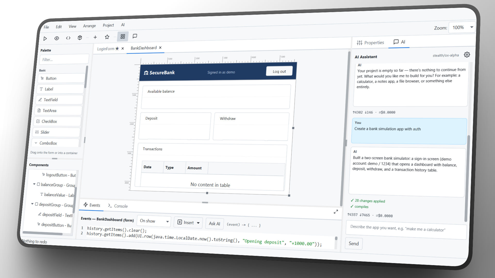

# Dragifier



**A visual RAD IDE for building JavaFX desktop apps — drag out the interface, write plain Java
behind it, and ship a self-contained `.exe`.** Or describe the app you want and let the built-in
AI assistant build both halves for you.

Pure Java on a modern stack: Java 26, JavaFX 26, no runtime dependencies in the apps you make.

```
gradlew run
```

---

## Build an app by describing it

The **AI** tab sits beside the properties inspector. Tell it *"make me a calculator"* or
*"create a bank simulation app with auth"* and it lays out the components **and** writes the
event handlers behind them — the screenshot above is one prompt.

It is wired to [OpenRouter](https://openrouter.ai), so you can point it at any model they
route to. Add your key in **File → AI Settings**, then hit **Refresh** to pick from the live
model list. Usage and cost are shown per turn.

What makes it trustworthy rather than a party trick:

- **Every change is checked by `javac` before you see it.** After the assistant edits your
  project, Dragifier generates the sources and compiles them headlessly. If anything is broken,
  the errors are handed back — pointing at *your* event code, not generated line numbers — and
  the assistant gets one round to fix it.
- **One `Ctrl+Z` undoes a whole turn**, however many components it touched.
- **Nothing is taken on faith.** Component ids, types, event keys, slots and property names are
  all validated against the real model. Anything refused is reported in the chat instead of
  quietly doing nothing.
- **Your images and media are never uploaded.** The assistant sees the structure of your
  project and your handler code; binary assets are replaced by a flag.

Two more places it shows up: **Fix with AI** on the compile-errors dialog, and **Ask AI** in the
event editor to write or explain the handler you have open.

Prefer to work without it? Everything below works exactly the same with the AI tab untouched.

---

## Design

**Drag from the palette onto the canvas.** Click to select, drag to move (8 px grid snap),
eight resize handles, arrow keys to nudge. Ctrl+click and marquee drag for multi-select;
group move, resize, align and delete.

- **Smart guides** — dashed lines appear while dragging when edges or centers line up with a
  neighbour or the form's centre, and the drag snaps to them
- **Nesting** — drop components *into* containers to any depth; the component tree shows the
  hierarchy and drag-reorders it
- **Docking** — give a component an edge (`TOP`/`LEFT`/`RIGHT`/`BOTTOM`/`FILL`) and it takes
  that side of whatever space is left, classic RAD style
- **Anchors** — on a resizable form, anchor left+right (or top+bottom) to stretch with the window
- **Rulers and zoom** — pixel rulers, 50–200 % zoom, live cursor readout
- **Arrange** — align, centre, same-size, z-order, and an Order editor for focus order
- **Lock** a component so it selects but can't be moved

The **properties inspector** is searchable and grouped: position and size, docking and anchors,
font family/size/bold/italic, text and background colour, borders with radius, padding, margin,
cursor, tooltip, visibility — plus per-type properties like a ComboBox's item list or a Grid's
dimensions.

## Components

**Basic** — Button, Label, TextField, TextArea, CheckBox, Slider, ComboBox, ListView,
RadioButton, ProgressBar, Hyperlink, Image

**Containers** — Panel, GroupBox, ScrollView, TabControl, Splitter, StackPanel, Grid, DockPanel

**Other** — Timer, Table, WebView, Media, FileBrowser

## Code

Select a component, pick an event, and write plain Java in the editor at the bottom — syntax
highlighted, with line numbers and Ctrl+Space autocomplete over your component ids and their
methods.

```java
label1.setText("Hello, " + textField1.getText() + "!");
```

Every component id is a field, so you reference things by the name you gave them. `stage` is the
form's own window. Opening another form is ordinary Java: `new Form2().show();`

Generated apps get a small `UI` helper — `UI.alert`, `UI.confirm`, `UI.prompt`, toast
notifications, file dialogs, clipboard, `UI.row(...)` for table rows, and `UI.eval` /
`UI.formatNumber` for arithmetic. The **Insert ▾** menu drops ready-made snippets in.

Beyond that there are **no third-party libraries** in what you build — just JavaFX and the JDK,
which is what keeps the packaged output small and self-contained.

## Run and ship

| | |
|---|---|
| **Quick Preview** (Shift+F5) | renders the form as a live window, no compile |
| **Run** (F5) | generates sources, compiles in-process with the `javac` API, launches your app as its own process. Output streams into the Console tab |
| **Export Java Code** (Ctrl+E) | writes the whole project out as plain `.java` files |
| **Package App** | `jpackage` produces a folder with `YourApp.exe` and a bundled Java+JavaFX runtime — runs on machines with no Java installed |
| **Package Installer (.exe)** | a Windows setup wizard with Start-menu entry. Needs the [WiX toolset](https://wixtoolset.org) (`dotnet tool install --global wix`) |

Compile errors are navigable: a Problems dialog lists them, and **Go to Code** selects the
component, opens the right event and puts the caret on the offending line.

## Projects

A project is a single portable `.dragifier` JSON file — images, media and the app icon are all
inlined, so there is nothing to lose track of. Multiple forms per project, each compiling to its
own `Stage` subclass; ★ marks the startup form.

Start from a template (**File → New from Template**): Hello World, Counter, Login Form,
Two Forms, Notepad, Calculator — each a complete working app to read.

Everything is undoable — drops, moves, resizes, property edits, event code, deletes, AI turns.
Drags and typing bursts coalesce into single steps.

## Shortcuts

| | | | |
|---|---|---|---|
| `Ctrl+N` | New | `F5` | Run |
| `Ctrl+Shift+N` | New from template | `Shift+F5` | Quick preview |
| `Ctrl+O` / `Ctrl+S` | Open / Save | `Ctrl+E` | Export Java code |
| `Ctrl+Z` / `Ctrl+Y` | Undo / Redo | `Ctrl+Shift+A` | Ask AI |
| `Ctrl+C` / `Ctrl+V` / `Ctrl+D` | Copy / Paste / Duplicate | `Ctrl+Shift+M` | Maximize code pane |
| `Ctrl+A` / `Delete` | Select all / Delete | `Ctrl+Shift+F` / `Ctrl+Shift+B` | Front / Back |
| `F2` | Rename component | | |

Renaming updates every reference to it in that form's event code.

## Requirements

A **JDK** (not a JRE) — Dragifier compiles your apps with the in-process `javac` API. Java 26 is
what it is built against. The Gradle wrapper fetches everything else.

## Working on Dragifier

```
gradlew run            # launch the IDE
gradlew smoke          # headless: codegen → compile, undo, rename, nesting, docking, templates
gradlew aiSmoke        # headless: AI prompt coverage, op applier, a full turn — no API key needed
gradlew packageSmoke   # the full compile → jar → jpackage pipeline (slow)
```

There is no JUnit suite; verification lives in those `main()` classes. See
[CLAUDE.md](CLAUDE.md) for the architecture and the cross-file checklists.

```
dev.dragifier.model    — the form data model (what gets saved)
dev.dragifier.ui       — IDE shell: palette, canvas, inspector, code editor, AI chat
dev.dragifier.ai       — the assistant: prompt, edit protocol, OpenRouter client
dev.dragifier.io       — project save/load
dev.dragifier.codegen  — Java source generation
dev.dragifier.runner   — compile and launch
dev.dragifier.packager — jpackage
```
